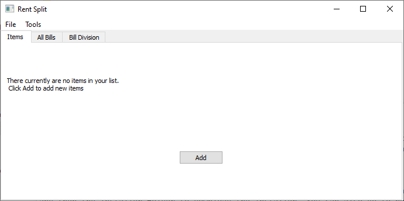
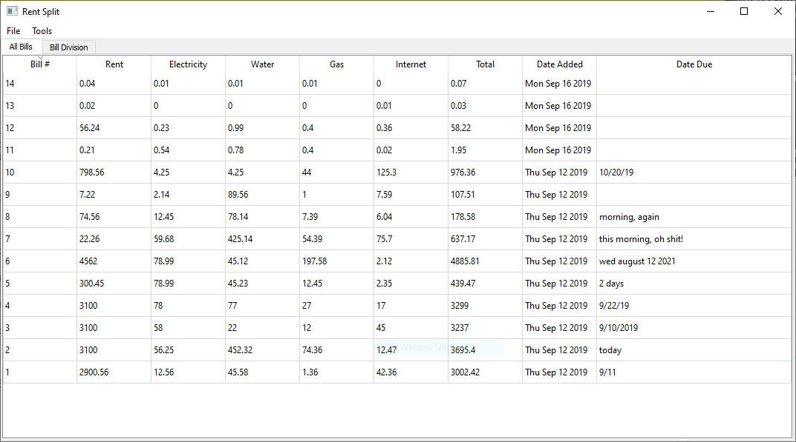
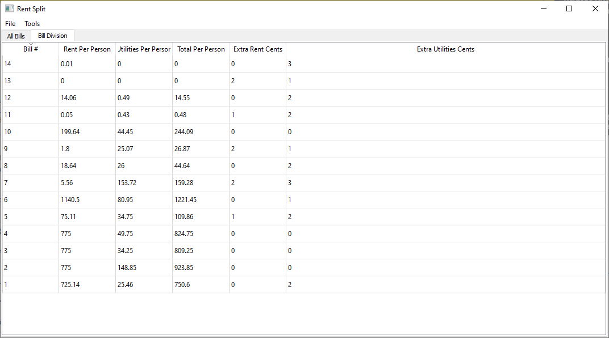

# Bill Split
An application I personally use to divide all bills related to apartment ownership between my 3 other roommates.

## Project Information
This program is a bill splitter, to be used in case someone has roommates that might not be too keen on numbers.
It is a simple project I worked on for my own benefit- I have roommates that need to pay their dues, thus this
program was made. PLEASE NOTE: THIS PROJECT DIVIDES ONLY BETWEEN 4 ROOMMATES, NOT MORE, NOT LESS.

## Getting Started
In order to get started, you can either download the src folder and compile the files yourself, or you can go to the build->installer.
You can also go to build->compiled files, and the EXE will be right there, thought this is a bigger file to download and you wont be able
to have either a desktop shortcut or a start menu shortcut with this option. Once the program is up and running, you will find a screen similar to this:

Once here, you can either click on the "Tools" button on the top to add a bill, or click "Add" on this landing page- both do the same action.

Once you have added a bill, the 'All Bills' tab and the 'Bill Division' will be updated accordingly. 'All Bills' lists the bill you just input,
while 'Bill Division' divides the bill amongst 4 people and accurately calculates what each person will owe.

From there, you can save your database, open a previous database, add another item, delete a certain item, or edit an item.

This is an example of what a filled up database could look like:

## Sources
This program was based on my old Ebay Selling List program, which is also available on my github,
which in turn was based on Qt's own [Address Book Example](https://doc.qt.io/qt-5/qtwidgets-itemviews-addressbook-example.html) .

## Tests
The tests folder holds a small file filled with dummy values that I used for debugging. I have made it available to the general public in case
anyone would want to check how the program works on their own. To use it, simply load the file as if it where any other saved Bill Split database.
If any notable bugs arise, please, post a message or send an email to emanueljose11@hotmail.com

### Technologies Used
This application was built with Qt 5.12.2 and C++11.

 